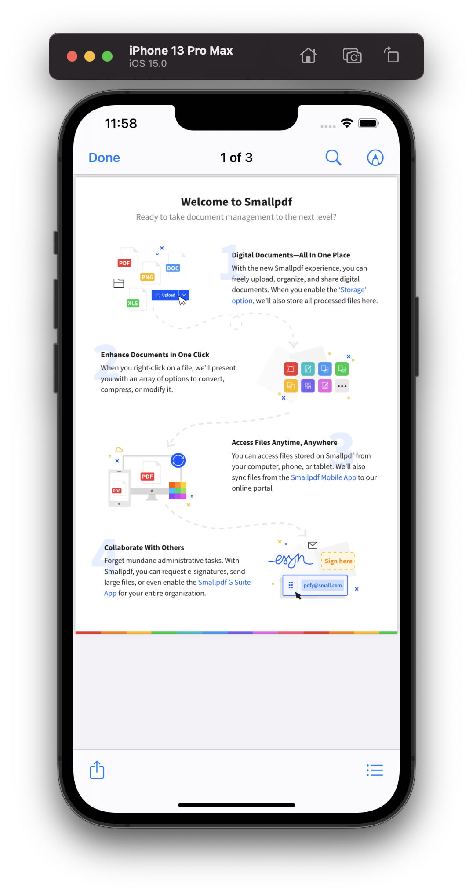

# Titanium iOS Document Viewer

Use the native `QLPreviewController` API in Titanium to display
all kinds of file types.

## Example

See the `example/app.js` for details.

## Author

Hans Knöchel

## License

MIT
